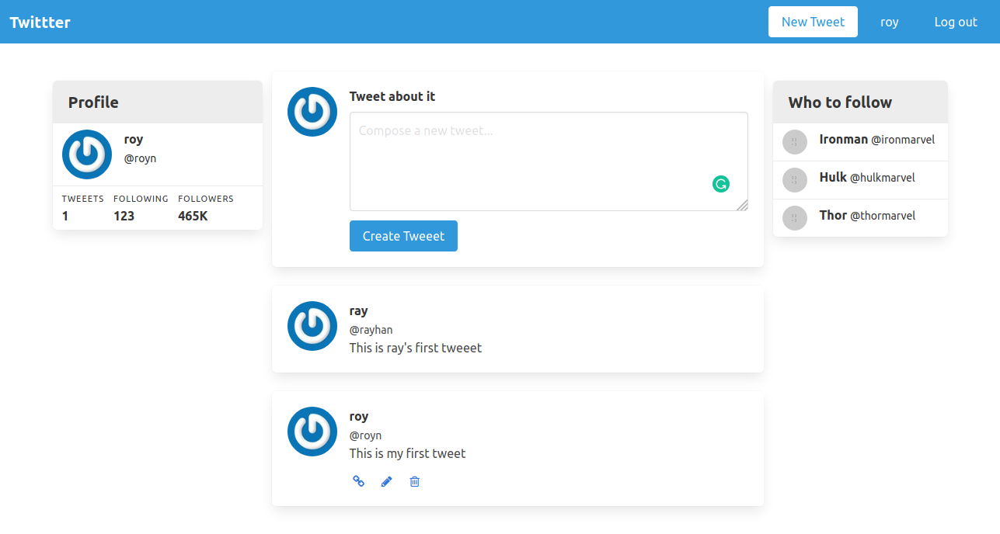

# Twitter Clone

## Project Description

This project involves building of a light weight version of Twitter following screen cast tutorials made by [Andy Leverenz](https://www.youtube.com/watch?time_continue=1&v=5gUysPm64a4&feature=emb_logo)

The purpose of the project is to get familiar with authentication in ruby on rails and obtaining an experience with Devise in the process.

A user is able to sign-up and sign-in, create, edit, and delete their tweet, view tweets made by all users.  A user **can not** edit or delete a tweet created by another user.

The code to the above screen casts can be found on [github](https://github.com/justalever/twittter)

### Screenshot

## Built With

- Ruby 2.7.1
- Ruby on Rails 5.2.4.3
- Devise gem (for authentication)
## How to run this project on your local machine

### Prerequisites
1. You should have ruby installed.(This project was tested on version `2.7.1`)
1. You should have rails installed.(This project was tested on version `5.2.4.3`)
1. You should have bundler installed.(This project was tested with Bundler version `2.1.4`)

   
### Steps to follow
1. Clone the repository to your local machine using `git clone git@github.com:RNtaate/twitter_clone.git`
1. On your local machine, navigate to the micro reddit folder using `cd twitter_clone` in your terminal
1. Install all the gems for the project by running `bundle` in your terminal
1. Migrate the database using this command
`bin/rake db:migrate`
1. Start the server by using this command.
`bin/rails server`

1. Open this link in your favorite browser `http://localhost:3000`

## Live Demo

- [twitter_clone](https://dry-cove-96508.herokuapp.com/tweeets)

## Contributions

  There are two ways of contributing to this project:

1.  If you see something wrong or not working, please check [the issue tracker section](https://github.com/RNtaate/twitter_clone/issues), if that problem you met is not in already opened issues then open the issue by clicking on `new issue` button.

2.  If you have a solution to that, and you are willing to work on it, follow the below steps to contribute:
    1.  Fork this repository
    1.  Clone it on your local computer by running `git clone git@github.com:RNtaate/twitter_clone.git` __Replace *RNtaate* with the username you use on github__
    1.  Open the cloned repository which appears as a folder on your local computer with your favorite code editor
    1.  Create a separate branch off the *master branch*,
    1.  Write your codes which fix the issue you found
    1.  Commit and push the branch you created
    1.  Raise a pull request, comparing your new created branch with our original master branch [here](https://github.com/RNtaate/twitter_clone)

## Authors

👤 **Roy Ntaate**

- Github: [@RNtaate](https://github.com/RNtaate)
- Twitter: [@RNtaate](https://twitter.com/RNtaate)
- Linkedin: [roy-ntaate](https://linkedin.com/in/roy-ntaate)

## Show your support

Give a ⭐️ if you like this project!

## Acknowledgments
- This project was originally taken from [the Odin project](https://www.theodinproject.com/courses/ruby-on-rails/lessons/authentication), following the tutorial of "*__Project 1__*" made by [Andy Leverenz](https://github.com/justalever/twittter)
- This project was inspired by the [Microverse](https:www.microverse.org) program